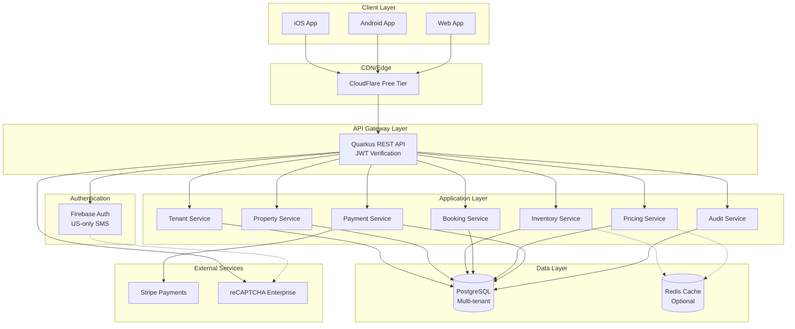

# Multi-Tenant Motel Booking Platform - Reference Architecture

## System Overview

A US-only, multi-tenant SaaS platform for motel/hotel booking with a single Flutter codebase (iOS/Android/Web) and Kotlin + Quarkus backend.

## Architecture Diagram

## Module Boundaries

### 1. **Tenant Module**
- **Responsibility**: Multi-tenancy management, tenant isolation
- **Key Components**:
  - Tenant registration and onboarding
  - User-to-tenant association
  - Role-based access control (OWNER, PROPERTY_ADMIN, FRONT_DESK)
  - Tenant context propagation
- **Data**: `tenants`, `tenant_users`, `tenant_roles`

### 2. **Property Module**
- **Responsibility**: Property and room type management
- **Key Components**:
  - Property CRUD (name, location, amenities, policies)
  - Room type definitions (bed types, max occupancy, base amenities)
  - Property-level settings (check-in/out times, cancellation policies)
- **Data**: `properties`, `room_types`, `property_amenities`

### 3. **Inventory Module**
- **Responsibility**: Room availability and allocation
- **Key Components**:
  - Daily inventory tracking per room type
  - Allocation and release logic
  - Oversell prevention (optimistic locking)
  - Stop-sell and min-stay restrictions
- **Data**: `inventory`, `inventory_allocations`
- **Critical Invariants**:
  - `allocated_count <= total_count` (enforced via DB constraints + transactions)
  - Optimistic locking using version column

### 4. **Pricing Module**
- **Responsibility**: Rate plans and dynamic pricing
- **Key Components**:
  - Rate plan definitions (BAR, corporate, weekend specials)
  - Nightly rate overrides by date range
  - Price calculation engine (base + taxes + fees)
  - Discount/promo code application
- **Data**: `rate_plans`, `nightly_rates`, `pricing_rules`

### 5. **Booking Module**
- **Responsibility**: Reservation lifecycle
- **Key Components**:
  - Booking creation (idempotent)
  - Booking modification and cancellation
  - Guest information management
  - Confirmation and notification
- **Data**: `bookings`, `booking_guests`, `booking_line_items`
- **Critical Invariants**:
  - Idempotency via `idempotency_key`
  - Atomic inventory allocation + booking creation
  - Status transitions (PENDING → CONFIRMED → CHECKED_IN → CHECKED_OUT → CANCELLED)

### 6. **Payment Module**
- **Responsibility**: Payment processing via Stripe
- **Key Components**:
  - Payment intent creation
  - Authorize/capture/refund flows
  - Idempotent payment operations
  - Payment reconciliation
- **Data**: `payments`, `payment_transactions`
- **Integration**: Stripe API with webhook handling

### 7. **Audit Module**
- **Responsibility**: Audit logging for compliance
- **Key Components**:
  - Immutable audit trail
  - Track changes to rates, availability, reservations
  - User action logging
- **Data**: `audit_logs`

### 8. **Short-Stay Module** (Optional/Future)
- **Responsibility**: Sub-daily booking blocks
- **Key Components**:
  - Block definitions (2am-7am rescue, 10am-4pm day-use)
  - Policy enforcement (when to allow short-stays)
  - Inventory coordination with nightly bookings
- **Data**: `short_stay_blocks`, `short_stay_policies`

## Deployment Architecture

### Development
- **Local**: Docker Compose (Postgres + Redis + Quarkus + Flutter web dev server)
- **Cost**: $0

### Production (MVP - $300/month budget)

| Component | Service | Tier | Cost |
|-----------|---------|------|------|
| **Backend** | Render.com / Railway.app | Starter | $7-15/month |
| **Database** | Neon.tech (Postgres) | Free → Pro | $0-19/month |
| **Cache** | Upstash Redis | Free | $0 |
| **Auth** | Firebase Auth | Blaze (pay-as-you-go) | ~$50-100/month (SMS) |
| **Payments** | Stripe | Pay-per-transaction | 2.9% + 30¢ |
| **CDN/DNS** | Cloudflare | Free | $0 |
| **Monitoring** | Grafana Cloud Free | Free | $0 |
| **CI/CD** | GitHub Actions | Free (public) / 2000 min | $0 |
| **Object Storage** | Cloudflare R2 | Free tier | $0 |
| **Total** | | | **~$60-135/month** |

**Scaling Path** (when revenue justifies):
- Backend: Scale to multiple instances ($50-100/month)
- Database: Neon Pro with autoscaling ($19-100/month)
- Cache: Upstash Pro ($10-50/month)
- Auth: Firebase with abuse controls (monitor costs)

## Technology Stack

### Client (Flutter)
- **Framework**: Flutter 3.16+ (single codebase)
- **State Management**: Riverpod 2.x
- **Routing**: go_router 13+
- **HTTP Client**: Dio 5.x
- **Local Storage**: shared_preferences, hive/isar
- **Forms**: flutter_form_builder + form_builder_validators
- **UI**: Material 3 design
- **Maps**: google_maps_flutter (property location)
- **Payments**: flutter_stripe

### Backend (Kotlin + Quarkus)
- **Framework**: Quarkus 3.6+ (GraalVM native optional)
- **Language**: Kotlin 1.9+
- **Build**: Gradle 8.5+ with Kotlin DSL
- **ORM**: Hibernate ORM with Panache Kotlin
- **Migrations**: Flyway
- **Validation**: Hibernate Validator
- **OpenAPI**: smallrye-openapi
- **Security**: quarkus-security, quarkus-oidc (Firebase JWT)
- **Observability**: quarkus-micrometer, quarkus-logging-json

### Database
- **Primary**: PostgreSQL 15+
- **Cache**: Redis 7+ (optional, for inventory/pricing)
- **Search**: PostgreSQL full-text search (MVP), Meilisearch (future)

### Authentication
- **Identity Provider**: Firebase Authentication
- **Methods**: 
  - Email/password (primary)
  - US-only SMS verification (secondary, for high-value actions)
  - Google Sign-In (optional)
- **Backend Verification**: Firebase Admin SDK for Kotlin
- **Abuse Prevention**: 
  - reCAPTCHA Enterprise (free tier: 10k assessments/month)
  - Rate limiting (Quarkus rate-limit extension)
  - SMS cooldown (1 SMS per phone per 60s)

### Payments
- **Provider**: Stripe
- **Integration**: Stripe Java SDK
- **Flows**: PaymentIntent (authorize → capture)
- **Webhooks**: Signature verification, idempotent handling

### DevOps & Observability
- **Containerization**: Docker + Docker Compose
- **CI/CD**: GitHub Actions
  - Flutter: lint (flutter analyze), test, build (iOS/Android/Web)
  - Backend: ktlint, test, build (JVM/native)
- **Logs**: Structured JSON logs (quarkus-logging-json)
- **Metrics**: Micrometer → Prometheus format
- **Tracing**: OpenTelemetry (quarkus-opentelemetry)
- **APM**: Grafana Cloud Free (Prometheus + Loki + Tempo)

## Non-Functional Requirements

### Performance
- **API Response Time**: p95 < 500ms (search/availability), p95 < 1s (booking)
- **Availability**: 99.5% uptime (MVP), 99.9% (production)
- **Concurrency**: Handle 100 concurrent users (MVP), 1000+ (scale)

### Security
- **Transport**: HTTPS only (TLS 1.3)
- **Auth**: JWT with 1-hour expiry, refresh tokens
- **Tenant Isolation**: Row-level tenant_id filtering on all queries
- **SQL Injection**: Parameterized queries only (Hibernate)
- **CORS**: Strict origin allowlist
- **Rate Limiting**: 100 req/min per IP (guest), 1000 req/min (authenticated)

### Data Retention
- **Bookings**: Indefinite (compliance)
- **Audit Logs**: 7 years (compliance)
- **Payment Data**: PCI-compliant (Stripe handles card data)

### Compliance
- **PCI-DSS**: Stripe handles card data (SAQ-A)
- **GDPR**: Not required (US-only), but implement data export/deletion
- **ADA**: WCAG 2.1 AA compliance for web

## Assumptions & Risks

### Assumptions
1. **US-only**: No international expansion in MVP (simplifies tax, compliance)
2. **Single Currency**: USD only
3. **English Only**: No i18n in MVP
4. **Modest Scale**: <100 properties, <1000 bookings/month in first 6 months
5. **Manual Onboarding**: Tenant onboarding via admin, not self-service
6. **No Channel Manager**: Direct bookings only (no OTA integrations)

### Risks

| Risk | Impact | Mitigation |
|------|--------|------------|
| **SMS Abuse** | High cost overruns | US-only allowlist, reCAPTCHA, rate limits, cooldowns |
| **Inventory Oversell** | Double bookings | Optimistic locking, DB constraints, integration tests |
| **Payment Failures** | Lost revenue | Idempotency, retry logic, webhook reconciliation |
| **Firebase Costs** | Budget overrun | Monitor usage, implement SMS quotas per tenant |
| **Scalability** | Performance degradation | Caching, DB indexing, horizontal scaling plan |
| **Vendor Lock-in** | Migration difficulty | Abstract auth (interface), use standard JWT |
